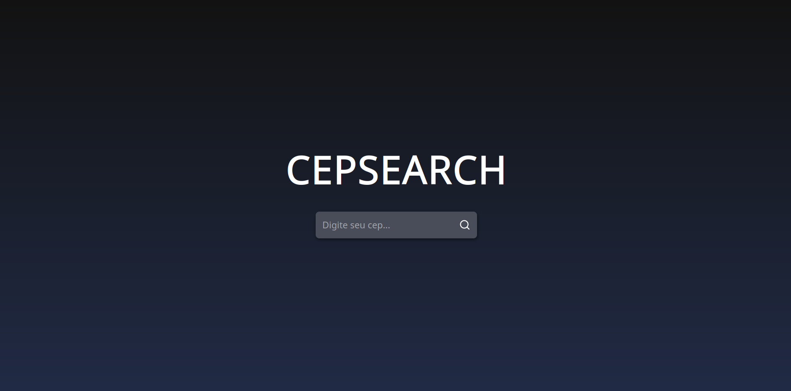
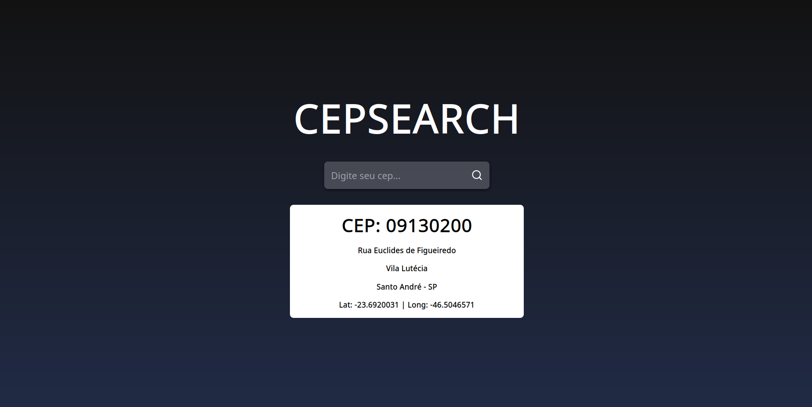

# cepsearch frontend

## About

Frontend developed to consume the [cepsearch API](https://github.com/WeversonL/cepsearch.git), which I developed to improve my knowledge in Java REST API's. React was used in this frontend, along with other technologies such as Docker, docker-compose and Redis in the backend, so that user requests are answered as quickly as possible.

## Screenshot

## Requirements

1. [Docker](https://docs.docker.com/engine/install/)
2. [Docker-compose](https://docs.docker.com/compose/)

### Optional dependencies

1. [Nodejs / npm](https://nodejs.org/en/download)
2. [Npx](https://www.npmjs.com/package/npx)

## Get Started

### Running the application with docker-compose

1. Clone the repository or download the source code

        git clone https://github.com/WeversonL/cepsearch-frontend.git
        cd cepsearch-frontend

2. Start with docker-compose

        docker-compose up -d

3. Open your browser and type in the URL bar

        http://localhost:3000/

### Run using npm

Make sure you have Nodejs and NPM installed on your machine.

1. Clone the repository or download the source code

        git clone https://github.com/WeversonL/cepsearch-frontend.git
        cd cepsearch-frontend

2. Download npm dependencies

        npm install

3. Run the npm project

        npm start

4. Open your browser and type in the URL bar

        http://localhost:3000/

### Compile the project in a production-optimized manner, with performance optimizations with minifications

Make sure you have Nodejs, NPM and NPX installed on your machine.

1. Clone the repository or download the source code

        git clone https://github.com/WeversonL/cepsearch-frontend.git
        cd cepsearch-frontend

2. Download npm dependencies

        npm ci

3. Build project

        npm run build
        
4. Install serve
        
        [⚠️ If you only want to use it locally and not install it globally, use: `npm install serve`]
        npm install -g serve 

5. Run project

        npx serve build

6. Open your browser and type in the URL bar

        http://localhost:3000/

⚠️ Still in development

## License

`cepsearch-frontend` is released under the [GNU General Public License, Version 2](LICENSE)
    
        Copyright (C) 2022 Weverson Lemos

        This program is free software; you can redistribute it and/or
        modify it under the terms of the GNU General Public License
        as published by the Free Software Foundation; either version 2
        of the License, or (at your option) any later version
